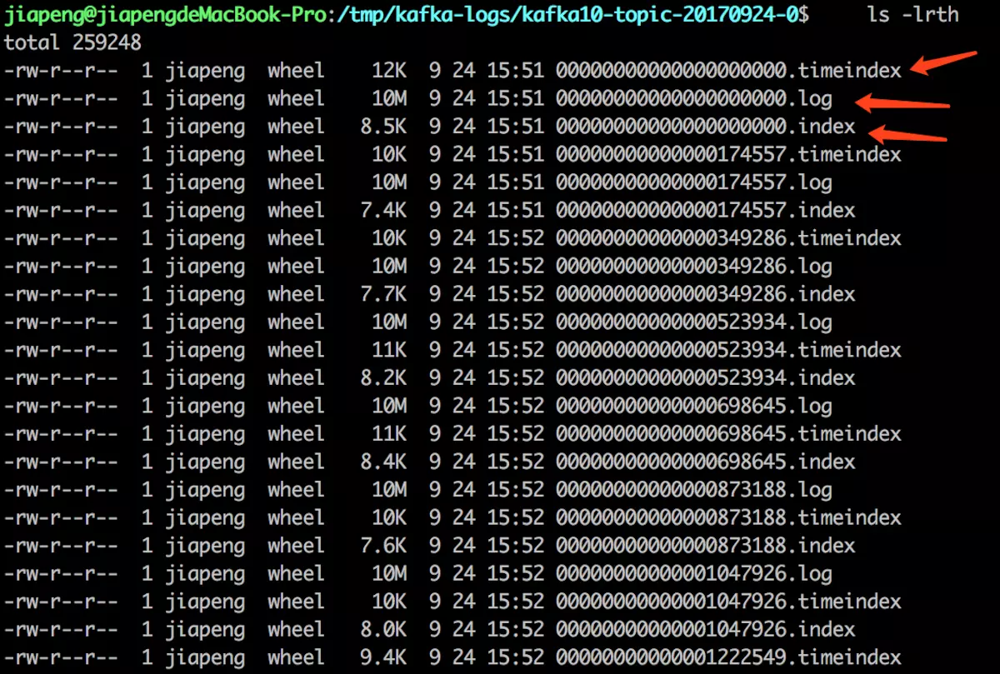
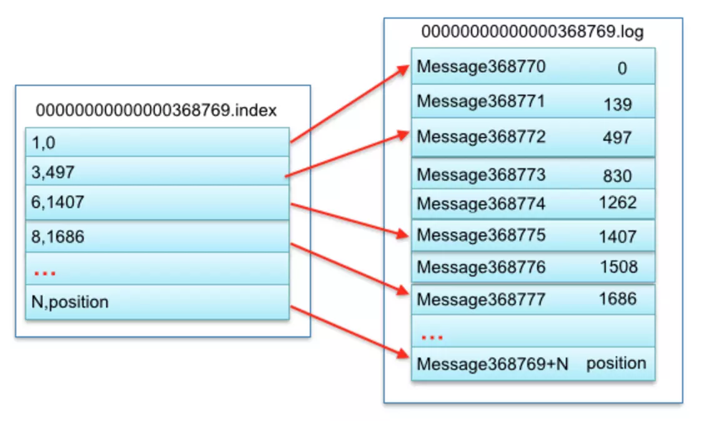
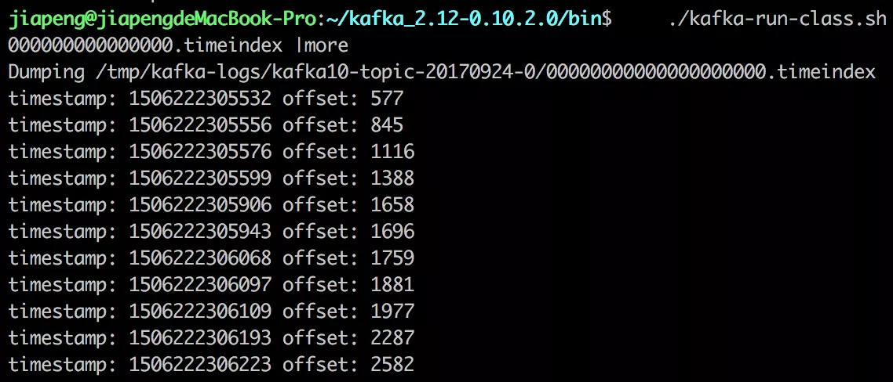
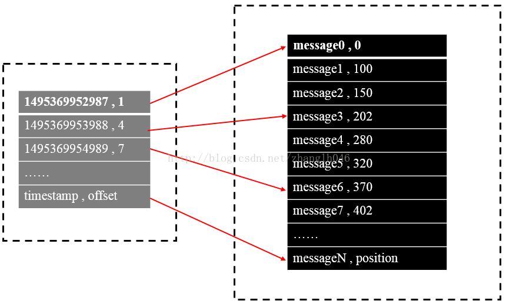

#### 消息存储设计  
- kafka的消息存储整体设计是基于topic和partition的，同一个topic下不同的partition对应不同的存储目录，目录命名规则为{topicName}_{partiton}。
- 每个分区下的存储由0到多个segment组成，1个segment由index文件、timeindx文件、存放数据的log文件组成   
下图展示的是一个分区下的文件列表： 

#### 各文件详细说明  
Log文件：  
- 每个log文件默认大小为1G，存放的具体的消息信息，格式为二进制格式  
- log文件以消息在分区的起始偏移量offset命名，长度为20位，不足左边补0，以0开始，第一个log文件的名称为00000000000000000000.log 
- 消息的物理格式，8个byte存储是消息在partition的offset，4byte存储小小的大小、其他的暂时先不关注  
index文件： 
- index文件存放对应的log文件的索引信息，文件名和对应的log名相同  
- 以hash的结构存储索引数据，key为相对offset，value为对应log文件中的实际物理偏移位置；相对offset指的是相对该文件对应的起始offset的值  
- kafka index文件构建的是稀疏索引，不会为每条消息建立索引，而是把某段数据中的一条作为索引，这样的好处是减少存储空间，缺点是搜索时间会更长  
下图是index文件与Log文件的映射关系  
  
time index文件：  
- time index文件存放的是根据时间戳创建的索引信息，文件名和对一个log名相同  
- 以hash结构存储索引数据，key为timestamp，value为相对offset  
- time index也是稀疏索引，并不会为每条记录设置索引
timeindex文件的内容格式如下：
 
 
**NOTE：**  
Kafka采用稀疏索引存储的方式，每隔一定的字节数建立了一条索引，可以通过“index.interval.bytes”设置索引的跨度

