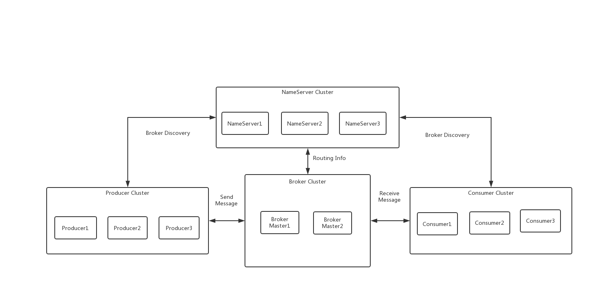
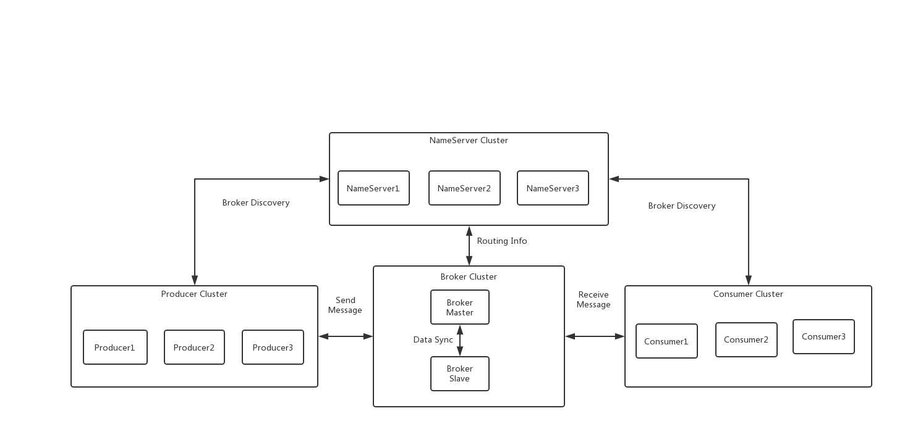
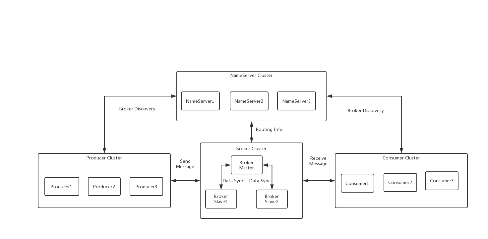
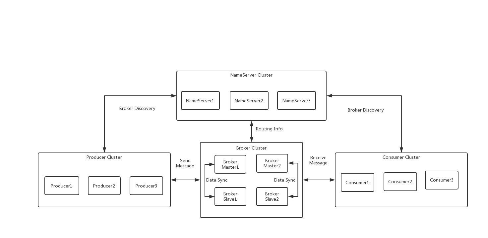
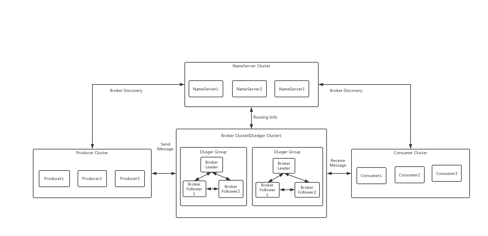

### 旧集群架构设计
旧集群架构包含单Master、多Master、单Master单Slave、多Master多Slave方式
##### 单Master集群

##### 多Master集群

##### 单Master单Slave集群

##### 单Master多Slave集群

##### 多Master多Slave集群

#### NameServer集群
NameServer集群中各节点之间互相不通信，每个节点都包含所有的broker的路由信息，这意味着，broker需要和NameServer集群中的所有节点进行通信，并把路由信息发送到所有节点上。  
#### Broker及M-S结构   
broker：  
- broker有三种角色：ASYNC_MASTER(异步主机)、SYNC_MASTER(同步主机)、SLAVE(从机)；如果对消息的可靠性要求比较严格，可以采用 SYNC_MASTER加SLAVE的部署方式(同步双写方式)。如果对消息可靠性要求不高，可以采用ASYNC_MASTER加SLAVE的部署方式(异步方式同步)。如果只是测试方便，则可以选择仅ASYNC_MASTER或仅SYNC_MASTER的部署方式。
- 有两种刷盘方式：ASYNC_FLUSH(异步刷盘，消息写到pageCache后返回，之后由操作系统异步刷回到磁盘中)，SYNC_FLUSH(同步刷盘，消息立即刷到磁盘中，之后返回)  

Master-Slave架构：
- Master与Slave的对应关系通过指定相同的BrokerName，不同的BrokerId定义，BrokerId为0表示Master、非0表示Slave。
- 支持1Master多Slave的架构，但只有BrokerId=1的从服务器才会参与消息的读负载  
### 新集群(DLedger)架构设计
#### DLedger集群

- 在DLeger Group中，各节点之间通过Raft算法进行数据一致性保证。  
