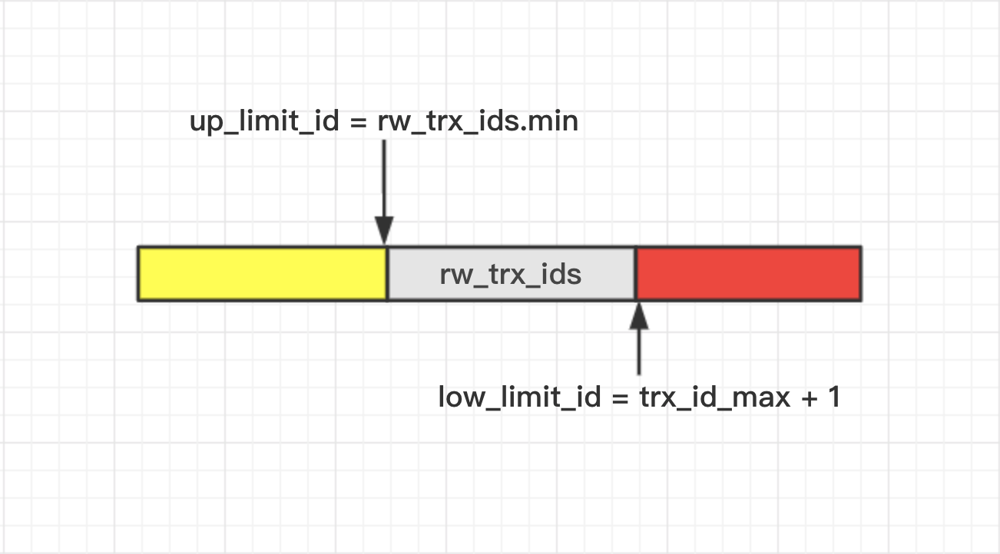

### MVCC 
全称Multiversion Concurrency Control,多版本并发控制。是一种并发控制技术，用于提高InnoDB存储引擎的并发度。
#### 多版本并发控制
 最早的数据库系统，只有读读之间可以并发，读写，写读，写写都要阻塞。引入多版本之后，只有写写之间相互阻塞，其他三种操作都可以并行，这样大幅度提高了InnoDB的并发度。 在内部实现中，与Postgres在数据行上实现多版本不同，InnoDB是在undolog中实现的，通过undolog可以找回数据的历史版本。找回的数据历史版本可以提供给用户读(按照隔离级别的定义，有些读请求只能看到比较老的数据版本)，也可以在回滚的时候覆盖数据页上的数据。在InnoDB内部中，会记录一个全局的活跃读写事务数组，其主要用来判断事务的可见性。   
 #### 常用的mvcc实现方式
 - 写新数据时，把旧数据转移到一个单独的地方，如回滚段；其他事务读数据时，从回滚段中把旧数据读出来；如oracle数据库和Mysql的InnoDB引擎。  
- 写新数据时，旧数据不删除，而是把新数据插入。postgreSQL就是使用的这种实现方式。 
#### mvcc在innodb中的应用场景  
MVCC只在READ COMMITTED(读已提交)和REPEATABLE READ(可重复读)两个隔离级别下工作。其他两个隔离级别够和MVCC不兼容, 因为READ UNCOMMITTED(读未提交)总是读取最新的数据行, 而不是符合当前事务版本的数据行。而 SERIALIZABLE(串行)则会对所有读取的行都加锁。

### MVCC实现原理

#### InnoDB存储引擎中每条记录都含有三个隐藏列 
- DB_TRX_ID(6byte): 用来标识最后一次对本行记录做修改(insert|update)的事务ID
- DB_ROLL_PTR(7byte): 指向写入回滚段(rollback segment)的undo logrecord的指针
- DB_ROW_ID(6byte): 一个随着新行插入而单调递增的行ID，当该表无法为创建聚集索引提供key时，会使用该行ID创建该表的聚集索引   
NOTE：  
delete操作，在innodb中是一次update操作，更新行中的一个特殊位将行表示为deleted，并非真正删除。    
每条记录的头信息(record header)里都有一个专门的bit(deleted flag)来表示当前记录是否已被删除。  
#### INNODB中的事务ID
InnoDB里面每个事务有一个唯一的事务ID，叫作transaction id。它是在事务开始的时候向InnoDB的事务系统申请的，是按申请顺序严格递增的。
#### undo log(回滚日志)  
-  Undo log是InnoDB MVCC事务特性的重要组成部分。当我们对记录做了变更操作时就会产生undo记录，Undo记录默认被记录到系统表空间(ibdata)中，但从5.6开始，也可以使用独立的Undo表空间。
- Undo记录中存储的是老版本数据，当一个旧的事务需要读取数据时，为了能读取到老版本的数据，需要顺着undo链找到满足其可见性的记录。当版本链很长时，通常可以认为这是个比较耗时的操作（例如bug#69812）
- 大多数对数据的变更操作包括INSERT|DELETE|UPDATE，其中INSERT操作在事务提交前只对当前事务可见，因此产生的undo日志可以在事务提交后直接删除(谁会对刚插入的数据有可见性需求呢！！),而对于UPDATE|DELETE则需要维护多版本信息，在INNODB中，UPDATE和DELETE操作产生的undo日志被归为一类，即update undo log  
- 在回滚段中的undo logs分为: insert undo log 和 update undo log 
  - insert undo log: 事务对insert新记录时产生的undolog, 只在事务回滚时需要, 并且在事务提交后就可以立即丢弃。
  - update undo log : 事务对记录进行delete和update操作时产生的undo log, 不仅在事务回滚时需要, 一致性读也需要，所以不能随便删除，只有当数据库所使用的快照中不涉及该日志记录，对应的回滚日志才会被purge线程删除。
#### 一致性读视图（consistent read view）
一致性读视图：某一时刻给事务系统trx_sys建snapshot(快照),把当时的trx_sys状态(包括活跃的读写事务数组)记下来，之后的所有读操作根据要读取记录的DB_TRX_ID和snapshot的trx_sys的状态比较，以此判断read view对于事务的可见性。
Read View中保存的trx_sys状态主要包括：
- low_limit_id:高水位(high water mark),大于等于read view中的low_limit_id的事务对于view是不可见的  
- up_limit_id: 低水位(low water mark),小于read view中的up_limit_id的事务对于view是可见的  
- low_limit_no: trx_no小于view中的low_limit_no的undo log对于view来说是可以purge(清除)的  
- rw_trx_ids:活跃的读写事务id数组  

如上图所示：   
up_limit_id:活跃读写事务数组中的最小事务id  
low_limit_id:所有已提交的最大事务id加1
trx_id_max:所有已提交的最大事务id
SELECT操作返回的结果的可见性由以下规则决定：
- 当记录的DB_TRX_ID < up_limit_id时，表示该记录的最后一次修改是在创建read view之前，可见；
- 当记录的DB_TRX_ID >= low_limit_id时，表示该记录的最后一次修改是在创建read view之后，不可见；此时，根据DB_ROLL_PTR查找undo log(此记录的上一次修改)，然后根据undo log的DB_TRX_ID根据该规则在计算一次可见性  
- 当 up_limit_id <= DB_TRX_ID < low_limit_id时，需要检查该DB_TRX_ID是否在该Read View中的rw_trx_ids中；
  - 当在rw_trx_ids中，表明该记录的最后一次修改在read view创建时还未保存，不可见；此时，需要根据DB_ROLL_PTR查找undo log(此记录的上一次修改)，然后根据undo log的DB_TRX_ID再从头计算一次可见性。
  - 当不在rw_trx_ids中，表明该记录的最后一次修改在read view创建之前，可见。  

经过上述规则的决议，我们得到了这条记录相对read_view来说，可见的结果。  
此时，如果这条记录的delete_flag为true，说明这条记录已被删除，不返回；如果delete_flag为false，说明此记录可以返回给客户端。  
**NOTE：**  
1、在当前事务中修改的记录，对当前事务来说是可见的！  
#### RR和RC隔离级别下MVCC实现的区别 
区别体现在创建一致性视图(Read View)的时机不同:  
- RR(可重复读)，会在执行事务中的第一条SELECT语句时创建read view，所以能保证每次读取的数据都是一样的（可重复读）
- RC(读已提交)，会在执行事务中的每条SELECT语句时创建read view，所以能保证每次SELECT时，读取到其他事务已经commit的数据  

### Q&A
1、事务隔离级别为RR，当事务1对某条记录SELECT ... FOR UPDATE,事务2能查询到该条数据的最新记录吗？   
A: 可以，原因：当事务2 SELECT的时候，会创建一个Read View,该记录的DB_TRX_ID会小于read view中的up_limit_id,因此是可见的。  
2、read view中为什么需要rw_trx_ids数组记录当前活跃的事务id？  
A: 用于当查询的记录的DB_TRX_ID在up_limt_id和low_limit_id之间时，判断该记录对于当前read view是否可见。  
3、有一些记录的DB_TRX_ID在up_limit_id和low_limit_id之间，但为什么对read view可见？  
A: 事务ID是单调递增的，在创建事务时生成；但事务执行的时间有长有短，导致先创建的事务可能会晚于后创建的事务提交，这样就会导致某些记录的DB_TRX_ID在read view的up_limt_id和low_limt_id之间，但是对read view是可见的。

参考文章：  
https://segmentfault.com/a/1190000012650596  
http://mysql.taobao.org/monthly/2018/03/01/  
https://www.cnblogs.com/stevenczp/p/8018986.html  
阿里mysql内核月报:http://mysql.taobao.org/   