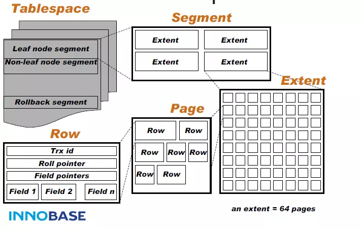

### innodb存储引擎体系结构  

#### 内存结构
- Buffer Pool  
加快数据和索引的访问，Buffer Pool把整体的内存区域按页进行分割，每个页里面包含很多数据  
- Change Buffer 
缓存二级索引（辅助索引）的更改（由INSERT、UPDATE或DELETE操作造成）  
Change Buffer后期会合并到Buffer Pool  

- Adaptive Hash Index(自适应哈希索引) 
- Log Buffer 
日志缓冲区，用于保存要写入磁盘上日志文件的数据

#### 磁盘上的存储结构
##### 表空间
- System Tablespace(系统表空间) 
系统表空间是InnoDB数据字典，双写缓冲区，更改缓冲区和撤消日志的存储区。如果在系统表空间中创建表，而不是在每个表文件或常规表空间中创建表，则它也可能包含表和索引数据。  
- File-Per-Table Tablespaces(每张表对应一个表空间)
包含对应表的数据和索引   
- General Tablespaces(通用表空间)  
常规表空间是InnoDB 使用CREATE TABLESPACE语法创建的共享表空间  
- Undo Tablespaces(undo 表空间)  
撤消表空间包含撤消日志，撤消日志是撤消日志记录的集合，其中包含有关如何通过事务撤消对聚集索引记录的最新更改的信息。撤消日志段中包含撤消日志，撤消日志段中包含撤消日志；  
撤消日志可以存储在一个或多个撤消表空间中，而不是 系统表空间中。  
- Temporary Tablespace(临时表空间)  
由用户创建的非压缩临时表和磁盘内部临时表是在共享临时表空间中创建的
##### InnoDB Data Dictionary（InnoDB 数据字典）  
InnoDB数据字典由包含元数据的用于跟踪对象的如表，索引，和表中的列的内部系统表。元数据实际上位于InnoDB系统表空间中。由于历史原因，数据字典元数据在某种程度上与InnoDB表元数据文件（.frm文件）中存储的信息重叠  
##### Doublewrite Buffer(双写缓冲区)  
存储从Buffer pool刷新过来的InnoDB写页，当写页写入到双写缓冲区之后，InnoDB把这些页写到它们对应的物理位置；  
当页写入过程中发生了操作系统或mysql进程崩溃的情况，在崩溃恢复期间可以从双写缓冲区中找到该页的副本  
##### redo log（重做日志）
重做日志文件记录了对于innoDB存储引擎的事务日志；  
当mysql实例挂了或服务器down机了，InnoDB存储引擎会使用重做日志来恢复数据。    
##### undo logs(撤销日志)
撤销日志，包含事务关联的撤销日志记录的集合，用于事务回滚操作  

### InnoDB 逻辑存储结构
