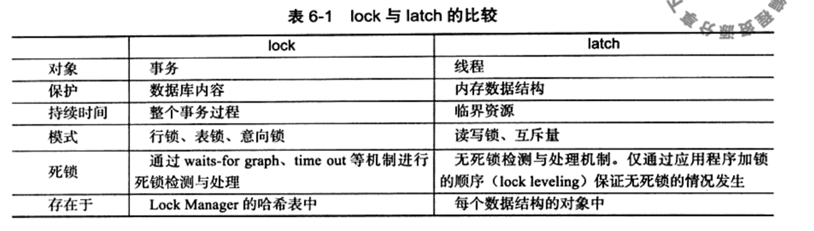
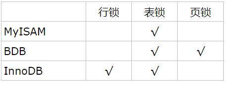
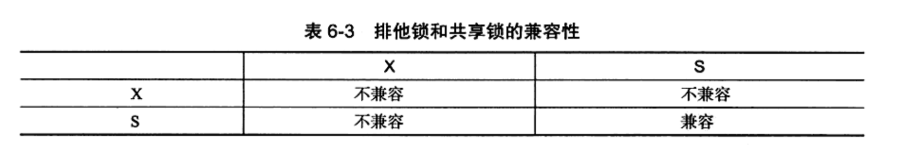
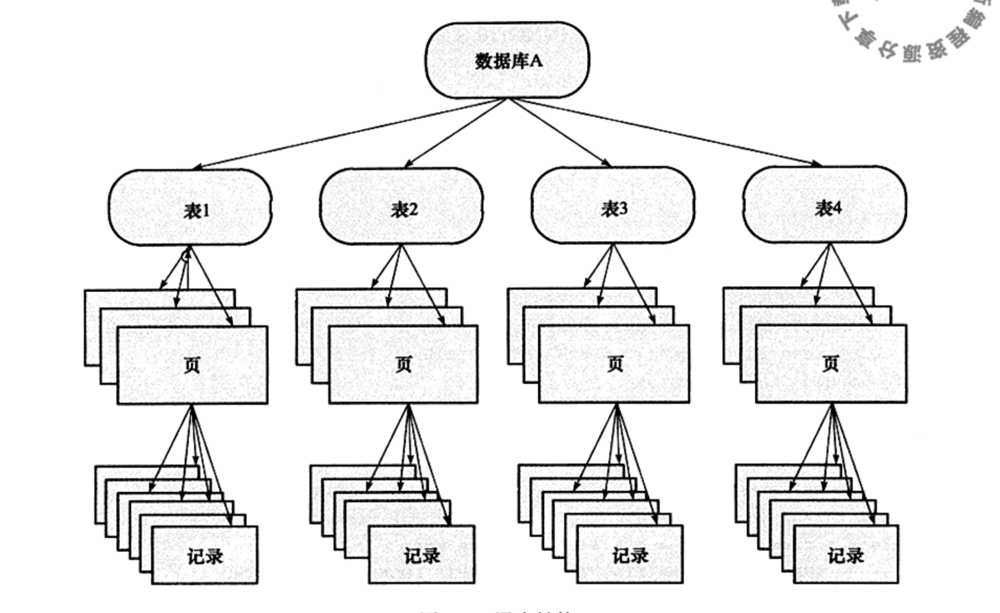
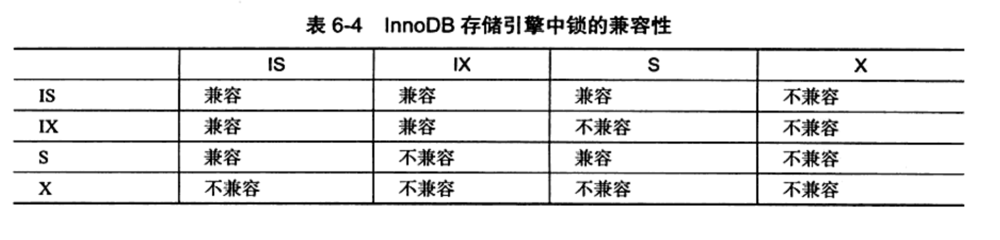

#### lock与latch  

NOTE：InnoDB存储引擎中是事务去申请锁资源，所以我们在InnoDB存储引擎中都是在事务中去对表或行进行加锁  
#### InnoDB和其他存储引擎支持锁的对比  

#### MySQL的表级锁有两种模式
- 表共享锁(Table Read Lock)  
- 表排他锁(Table Write Lock)  
#### 两种行级锁 
- 共享锁（S Lock）  
- 排他锁 (X Lock)  

S锁和X锁都是行级锁，它们的兼容性是针对同一行记录  
#### 意向锁的实现原理以及InnoDB存储引擎对意向锁的实现  
意向锁的引入是为了实现在多粒度上锁定的；意向锁将锁定的对象分为多个层次；  
实现原理：假设事务A向记录A上加X锁，我们需要再页A、表A、数据库A上加IX(意向锁)；当事务B需要对表A加S锁的时候，发现表A已经添加了IX锁，则事务B会等待事务A把commit或rollback释放锁。  
InnoDB存储引擎对意向锁的实现：  
InnoDB存储引擎中的意向锁设计为表锁，支持两种类型的意向锁：  
- IS(意向共享锁)：事务获取表中某些行的S锁  
- IX(意向排他锁)：事务获取表中某些行的X锁  
意向共享锁、意向排他锁、共享锁、排他锁的兼容关系  
   
#### 为什么引入意向锁  
问题：如果事务T要对表A加X锁，那么需要判断表A下的每行记录是否加了S或X锁，这样效率很慢  
引入意向锁之后，当事务T要对表A加X锁，在这之前，已经有事务对表A中的R记录加了X锁，那么此时表A上有IX锁，当事务T准备对表A加锁时，由于X锁与IX锁不兼容，事务T要等待行锁释放。这样就提高了判断的效率！  
#### 如何查看事务和事务占用锁的情况  
在information_schema库中有三张表：  
INNODB_TRX：描述事务信息  
INNODB_LOCKS：事务锁的信息  
INNODB_LOCK_WAITS：事务锁等待的信息

