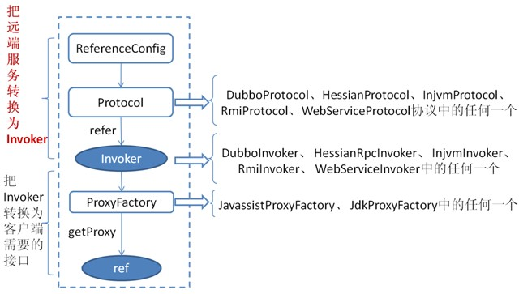

### zookeeper作为dubbo的注册中心
#### 问题
1. zookeeper作为dubbo的注册中心，存储了哪些数据？
2. provider是如何把服务注册到zookeeper中的？
3. consumer是如何从zookeeper中消费服务的？

#### 1、zookeeper作为dubbo的注册中心，存储了哪些数据？
**存储结构**

二级子节点除了providers和consumers,还有configurators（负载均衡）、routers（路由信息）。  
其中，
***consumers节点下存放的数据如下所示：***  
consumer://192.168.198.1/com.example.dubbo.service.CityService?application=consumer&category=consumers&check=false&dubbo=2.5.3&interface=com.example.dubbo.service.CityService&methods=findCityByName&pid=1976&side=consumer&timestamp=1547599528693  

***providers下存放的数据如下所示：***  
dubbo://192.168.198.1:20880/com.example.dubbo.service.CityService?anyhost=true&application=provider&dubbo=2.5.3&interface=com.example.dubbo.service.CityService&methods=findCityByName&pid=17608&side=provider&timestamp=1547599515151

***routers节点下存放的数据如下所示：***
route://0.0.0.0/com.example.dubbo.service.CityService?category=routers&dynamic=false&enabled=true&force=false&name=cityservice&priority=10&router=condition&rule=method+=+findCityByName+&+consumer.host+=+192.168.198.1+=>+provider.port+=+20881+&+provider.port+!=+20880&runtime=false  

***configurators节点下存放的数据如下所示：***
override://0.0.0.0/com.example.dubbo.service.CityService?category=configurators&dynamic=false&enabled=true&loadbalance=random

#### 2、provider是如何把服务注册到zookeeper中的？

**服务暴露过程**  
1. 通过ServiceConfig获取到服务接口的实现类ref
2. 通过ProxyFacotry把ref生成Invoker(AbstractProxyInvoker),该Invoker为包含了ref的代理类。通过调用Invoker#invoke()方法调用对应ref类的方法。
3. 通过Protocol的实现类把Invoker转化为Exporter（含有Invoker对象）,这里的Invoker会经过2层的Protocol的处理，第1层为RegistryProtocol的处理，第2层为具体的服务协议Ptotocol（例如：DubboProtocol）的处理. 这里以注册中心为zookeeper，服务协议为dubbo举例；在RegistryProtocol中会调用ZookeeperRegistry把服务注册到zookeeper中；在DubboProtocol中，一是会生成DubboExporter,并存放到Map中，用于根据consumer端的rpc请求中的serviceKey定位到对应的Exporter,二是会创建NettyServer并启动（Dubbo协议采用的netty通讯协议）

**服务注册的过程**  
1. 服务注册的过程发生RegistryProtocol中
2. 通过特定的Registry把服务注册到对应的注册中心上
3. dubbo中包含zookeeper、redis、etcd、nancos等类型的注册中心，用户也可以使用自定义的注册中心 

#### 3、consumer是如何从zookeeper中消费服务以及如何在本地缓存服务？

**服务消费过程**  
1. 通过ReferenceConfig获取到服务接口的name和class
2. 调用RegistryProtocol#refer()方法生成一个ClusterInvoker;我们需要知道的是，这个service的每个提供者都是一个Invoker，该Invoker会根据不同的通讯协议生成(例如：dubbo协议对应DubboInvoker),该invoker包含了与服务端通信的细节。在RegistryProtocol中，会把所有的Invoker组合成一个ClusterInvoker对外提供。
3. 使用ProxyFacotry#getProxy(invoker)生成该接口的代理类，该接口的任何方法调用，最终都转换为invoker#invoke()进行rpc调用。

**如何从zk中获取服务列表以及转换为对应类型的ClusterInvoker**  
1. 生成一个目录服务（RegistryDirectory），该目录服务用于维护该服务下的所有Invoker，并监听注册中心的变化，根据变化刷新invoker列表
2. RegistryDirectory实现了NotifyListener接口，用于当注册中心服务配置发生变化后，接收与当前服务相关的变化，然后根据配置的变更刷新invoker列表  

**consumer如何缓存服务信息**  
1. dubbo缓存服务信息的实现方式有点意思；它是把服务接口下的所有提供者URL信息缓存在set集合中，当与注册中心连接中断后，消费者会根据缓存的提供者信息生成Invoker列表。但无法获取之后更新的服务。