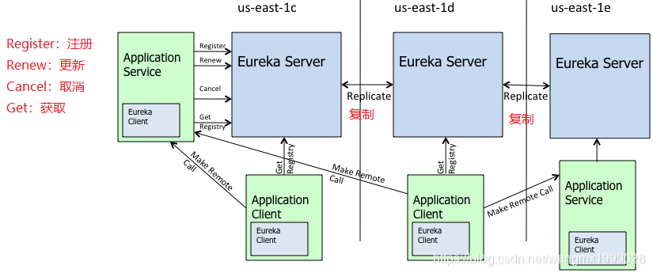

### Eureka作为注册中心

#### 问题
1. eureka client往server注册的信息内容是什么？
2. client和server之间的操作有哪些？是以什么样的方式进行交互的？
3. server集群中的节点之间是如何同步数据的？
4. eureka server的自我保护模式是什么？

#### 1、eureka client往server注册的信息内容是什么？

#### 2、client和server之间的操作有哪些？是以什么样的方式进行交互的？
**操作有以下4种：**
- Register(注册)  
- Renew(续租)
- Fetch Registry(获取注册表)  
- Cancel(取消，告知Server剔除该实例) 

**交互方式：**  
server提供restful的接口，client端通过http请求的方式进行访问。  
**Register(注册)操作**  
- Eureka client实例在应用启动时，会往Eureka server注册实例  

**Fetch Registry(获取注册表)**  
- client启动时，会启动定时任务去拉取注册表，默认间隔30s（这个间隔时间会根据获取数据是否超时而动态改变，最大不超过60s）  
- 注册表的数据会在本地缓存
- 注册表数据的缓存方式为
AtomicReference\<Applications>
其中，Applications里面包含了Application的集合，
而Application里面又包含了InstanceInfo的集合

**Renew(续租)**
- client启动时，会启动定时任务去与server维持心跳，默认时间30s这个间隔时间会根据获取数据是否超时而动态改变，最大不超过60s）    
- 当client与server断开连接时，会调用注册接口进行注册（重连）  

**Cancel(unregister)**
- 当client关闭的时候（调用shutdown方法）时，会调用cancel方法告知server剔除该实例

#### 3、server集群中的节点之间是如何同步数据的？

**eurekaServer集群特点**
- 集群保证的是AP
- 集群中的节点都是对等的，没有主从之分

**节点之间同步注册信息的流程**  
1. 初始化集群节点，定时更新集群节点信息（默认间隔时间为10分钟）『 通过调用PeerEurekaNodes#start()』
2. 获取初始的注册信息；从兄弟节点那里获取注册信息，注册到自己本地 『通过调用PeerAwareInstanceRegistryImpl#syncUp()』
3. 同步注册信息；当client往当前server发起操作（Heartbeat, Register, Cancel, StatusUpdate, DeleteStatusOverride），当前server完成后，会向集群中的其他节点发起同步（复制）操作。『PeerAwareInstanceRegistryImpl#replicateToPeers()』

#### 4、eureka server的自我保护模式是什么？
**作用**  
防止因为client与server之间的网络分区，导致server的注册数据清除

**client在什么情况下会从server的注册数据中清除？**  
- client主动执行反注册操作（cancel）
- client连续3次renew失败，server会自动剔除client  

**server在什么情况下进入自我保护模式？**  
eureka.enableSelfPreservation设置为true(默认)，同时server的注册表的数据多于15%（统计周期15分钟）属于client连续3次renew失败的情况下，server会进入自我保护模式。
**server在什么情况下退出自我保护模式？**
1. 自我保护模式设置为禁用 eureka.enableSelfPreservation=false 
2. 能够正常维持心跳的client数回到预期的阈值(默认为85%)上 eureka.renewalPercentThreshold=0.85  

只要满足上面两个条件中的任何一个都将退出自我保护模式

