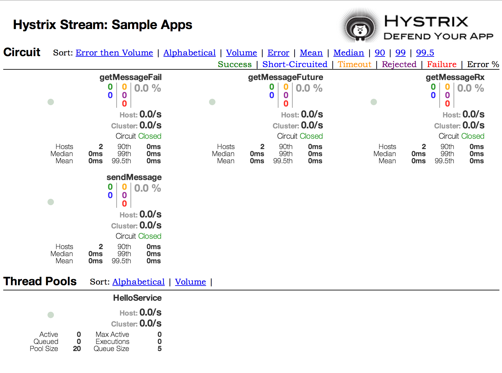

### hytstrix

#### hystrix监控 与 Turbine
hystrix会通过/hystrix.stream暴露监控数据，我们可以借由hystrix dashboard来查看每个断路器的状态数据，如下图所示

其中，每个HystrixCommand对应一个断路器。  
但是，/hystrix.stream只能暴露其中一个hystrix实例的监控数据，如果我们想把这个系统的所有hystrix实例的监控数据都暴露出来，我们需要引入turbine,turbine能把所有的hystrix.stream都汇聚到turbine.stream，并把turbine.stream展示到hystrix dashobard上。