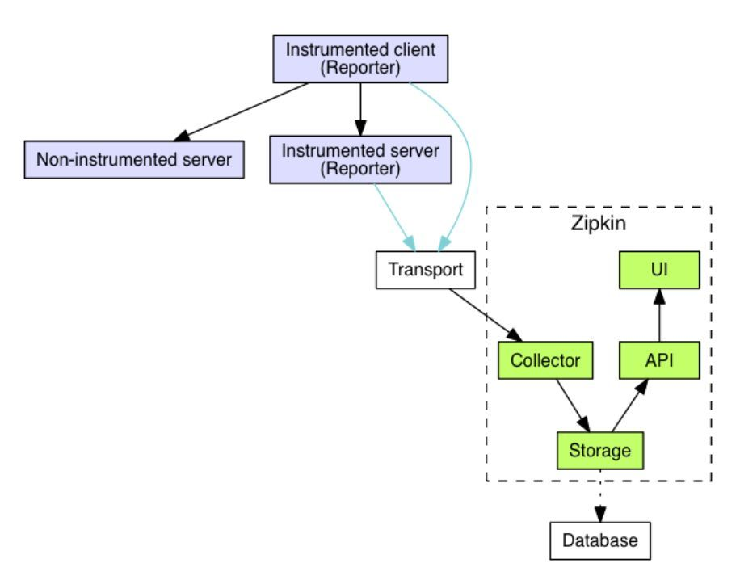

### zipkin
是什么？为什么需要zipkin？应用场景？这些问题的答案见”分布式链路追踪.md“
#### 如何使用？

#### 设计思路
**整体架构图**

其中Reporter集成在每个服务的代码中，负责Span的生成，带内数据(traceid等)的传递，带外数据(span)的上报，采样控制。Transport部分为带外数据上报的通道，zipkin支持http和kafka两种方式。Colletor负责接收带外数据，并插入到集中存储中。Storage为存储组件，适配底层的存储系统，zipkin提供默认的in-memory存储，并支持Mysql，Cassandra，ElasticSearch存储系统。API提供查询、分析和上报链路的接口。接口的定义见zipkin-api。UI用于展示页面展示。

**Reporter**  
添加了检测库的应用都能成为reporter，检测库的作用是埋点生成日志，把日志传输给zipkin。检测库一般以jar包的形式存在，常见的有：  
- brave：zipkin提供的
- Spring Cloud Sleuth：spring提供的  

