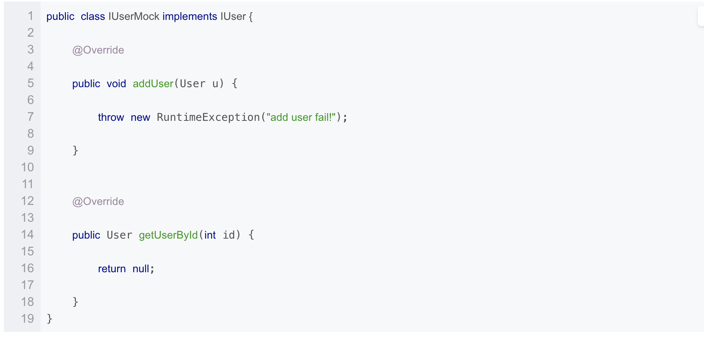
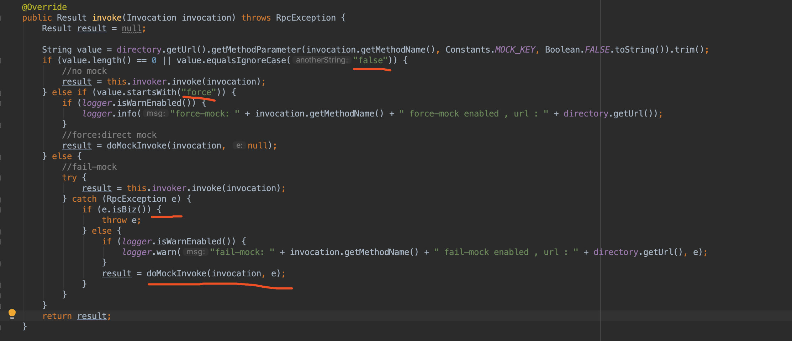

### dubbo的服务降级机制

#### 使用
1、通过设置mock属性，有两种方式：第一种是mock=“return null” 直接返回结果，第二种是将mock设置为true或class类名,如果设置为true，缺省为服务接口名+Mock后缀的实现类，实现服务接口，该实现类必须包含一个无参构造函数，在该实现类中实现各个方法的降级逻辑。如：

也可以将mock设置为实现降级逻辑的class的名

#### 实现原理
1、当mock设置为false的时候，不走降级逻辑  
2、当mokc设置为force时，强制走降级逻辑  
3、当mock设置为true时，当rpc调用失败时，走降级逻辑  
源码如下：

