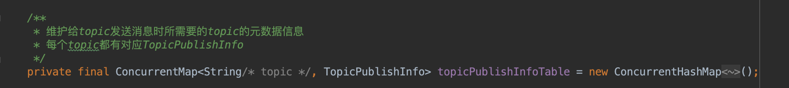
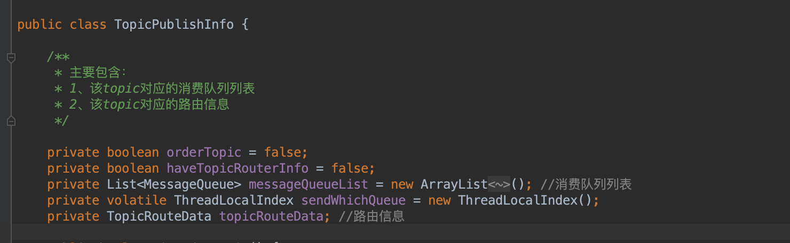
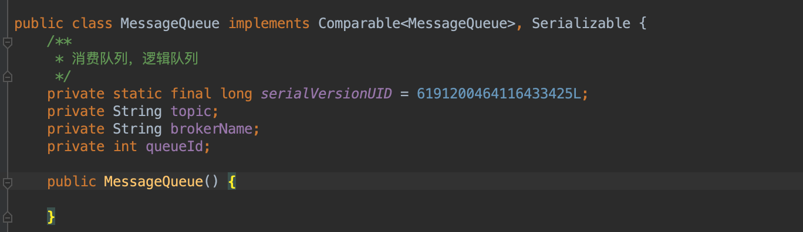
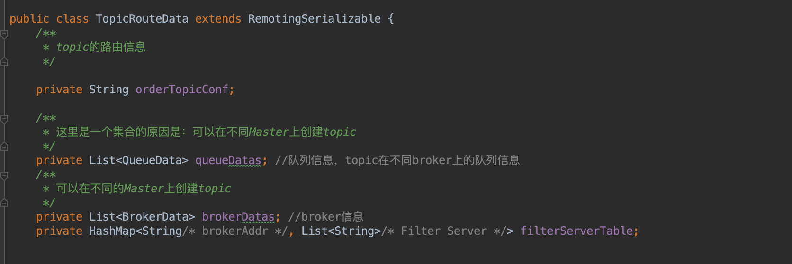
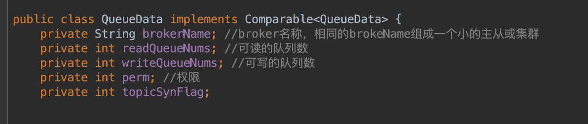
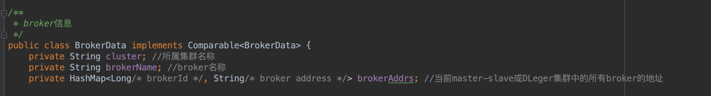

Producer端topic的TopicPublishInfo的信息维护在DefaultMQProducerImpl类中

TopicPublishInfo存放的是producer端给topic发送消息时所需要的元数据信息  

MessageQueue是topic的消费队列，方便消费者订阅时，能够更快速的检索到消息 

TopicRouteData存放的是topic在broker中的路由信息 
 

QueueData中存放的是topic在一个Master集群或Dleger集群中的队列信息  

BrokerData中存放的是topic在一个Master集群或Dleger集群中broker的信息

