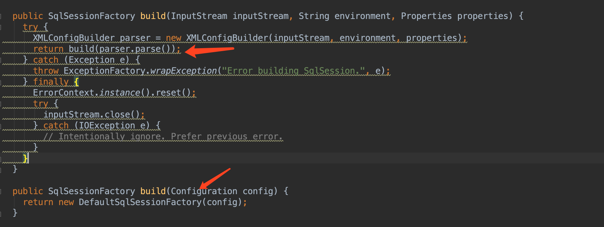
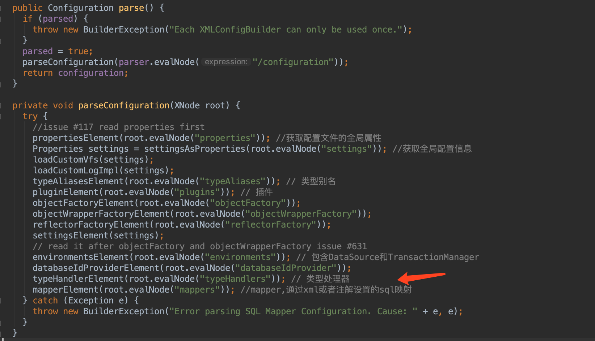
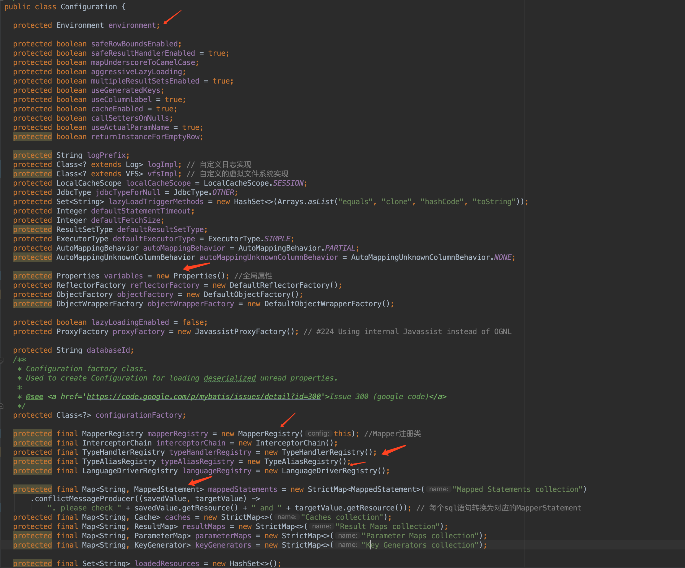
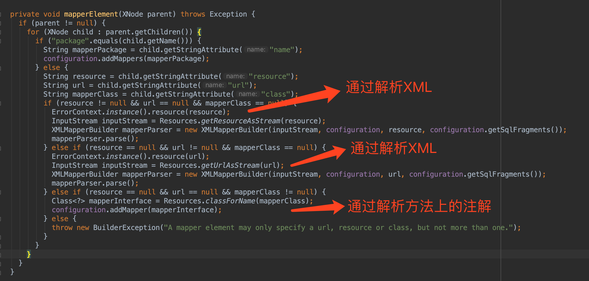
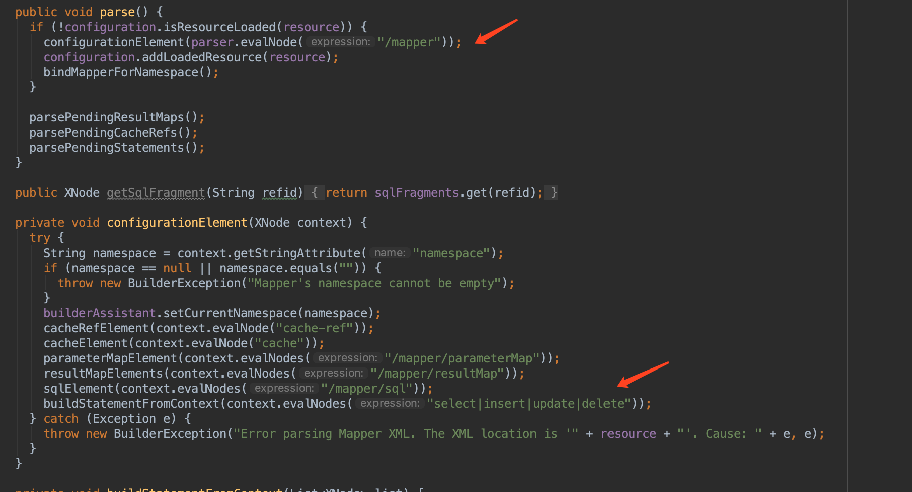
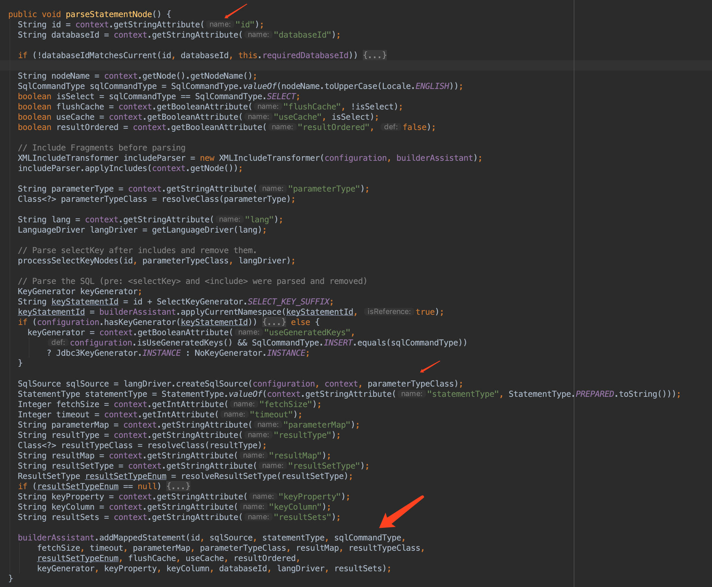
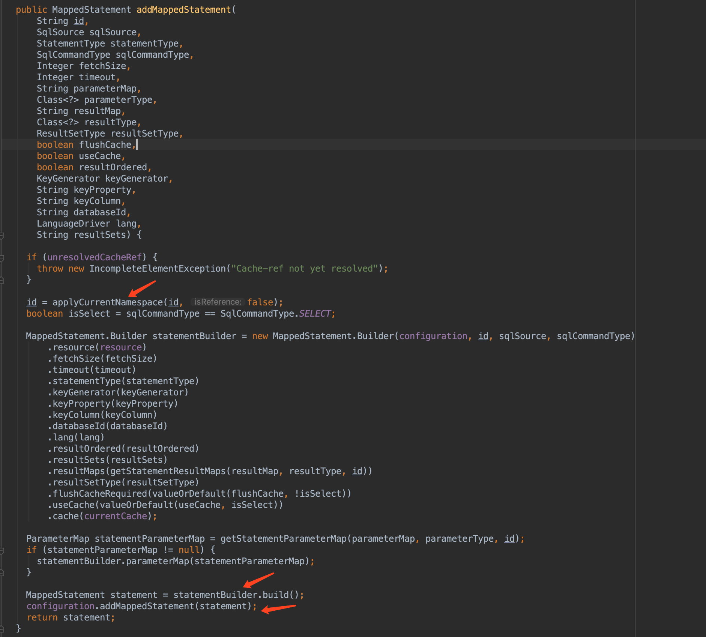
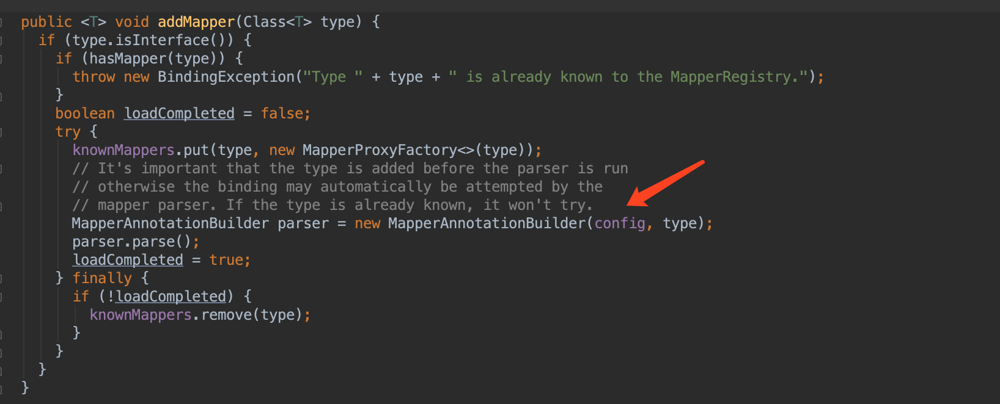
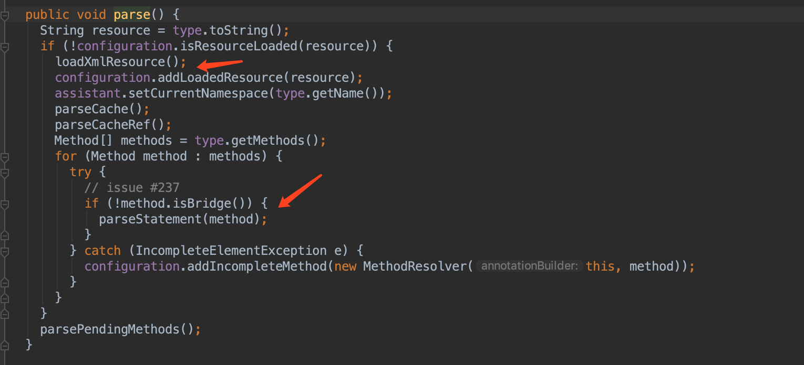
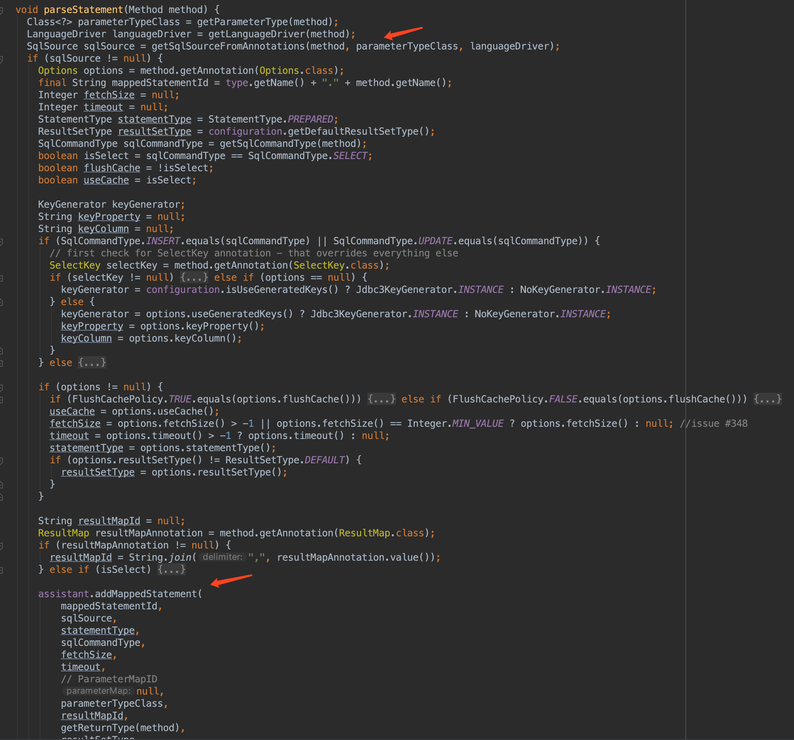

### 整体流程
1、SqlSessionFactoryBuilder提供多个build的方法来构造SqlSessionFactory,这里我们使用其中一个build方法  

我们可以看到，最终是调用了参数类型Configuration的build方法，接下来看如何把InputStream解析为Configuration  

2、解析逻辑在XMLConfigBuilder的parse方法  

我们可以看到，通过这个方法我们最终能得到一个Configuration的实例。进入到Configuration的源码中，我们可以看到它包含的属性

3、我们重点关注一下如何把Mapper文件或Mapper类的sql转换为MappedStatement的过程

- 把xml中的sql语句转换为MappedStatement,这个转换是在XMLMapperBuilder中完成的  

交由XMLStatementBuilder去处理  

最后把MappedStatement添加到Configuration里面，key为namespace + id  

- 把Mapper接口类中方法上通过主键设置的sql转换为MappedStatement，这个过程在MapperRegistry中完成

交由MapperAnnotationBuilder的parse方法处理  

最后把MappedStatement添加到Configuration里面，key为namespace + id  
