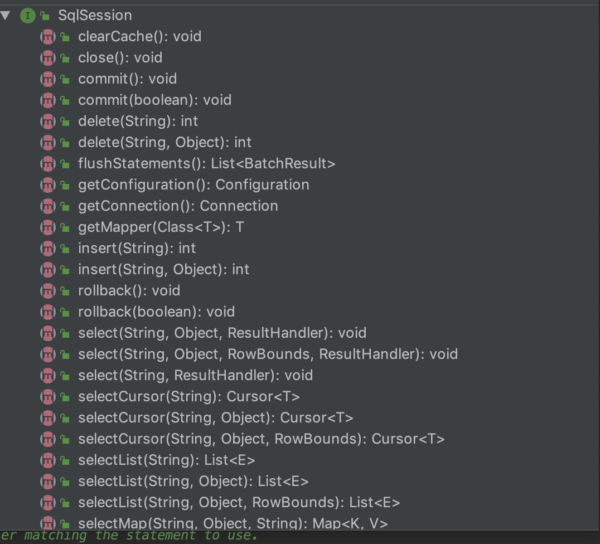
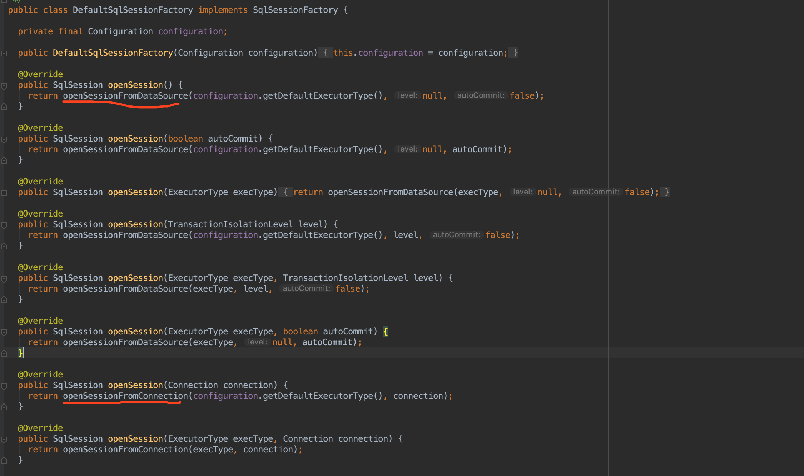
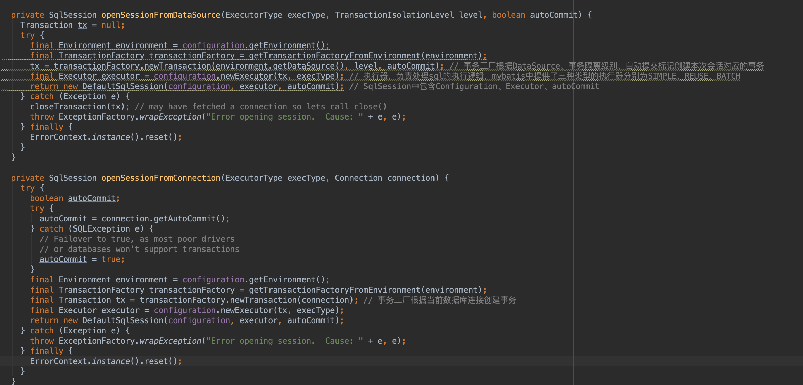

### SqlSession
sqlSession是操作数据库的类，提供了大量的操作方法，包含增删该查等功能  

### 整体流程
1、通过SqlSessionFacotry创建SqlSession,DefalutSqlSessionFacotry类中提供了很多openSession的重载方法用于创建SqlSession

从源码中，我们可以看到最终委派给了openSessionFromDatasource或openSessionFromConnection方法，接下来，我们看这两个方法创建SqlSession的过程

创建SqlSession的过程主要分为四步：  
第一步：获取TransactionFactory  
第二步：通过TransactionFactory获取Transaction  
第三步：根据Transaction和execType获取Excutor,mybatis3中存在3种类型的Executor分别为SIMPLE、REUSE、BATCH  
第四步：根据Configuration、Executor、autoCommit创建DefaultSqlSession  
