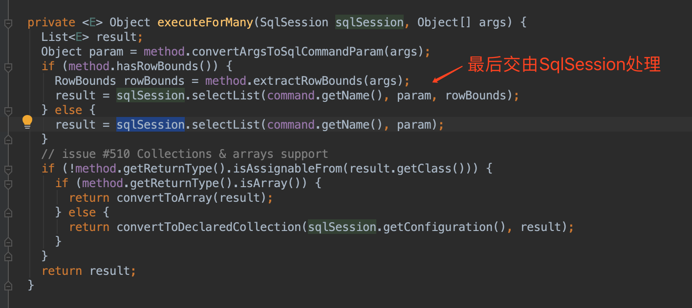

#### 整体流程 
基于接口注解的方式执行sql，在添加Mapper的过程中，会为Mapper类设置一个代理工厂类，之后再获取这个Mapper类的时候会通过这个代理工厂类生成一个代理类，生成代理类的方式时通过JDK的动态代理实现。  
#### MapperRegistry注册Mapper  

#### DefalutSqlSession获取Mapper  

从代码中可以看到，该方法里面直接调用了configuration.getMapper方法，我们进入Configuration类看一下getMapper的实现  
 
发现最终是由MapperRegistry的getMapper方法处理，我们进入到getMapper方法看看具体实现  

 我们发现最终是通过我们之前设置的代理工厂类来生成一个代理类，进入工厂类的对应方法看一下实现  
 
 可以看到使用jdk的动态代理方式生成代理类
#### 通过调用接口的方法执行sql的流程  
第一步：我们要获取对应Mapper，通过上面的流程我们得知，返回的Mapper实例是一个代理类  
第二步：我们通过Mapper实例调用具体的方法，我们执行具体的方法之前，会将方法委派给MapperProxy的invoke方法  

该方法里面主要完成两部分工作：  
1、当第一次调用的时候，把Method包装成MapperMethod，同时本地缓存  
2、调用MapperMethod.execute(sqlSession,args)方法  
第三步：调用MapperMethod.execute方法  

第四步：调用sqlSession的相关方法处理，后续的流程同“通过sqlSession执行sql的流程”

