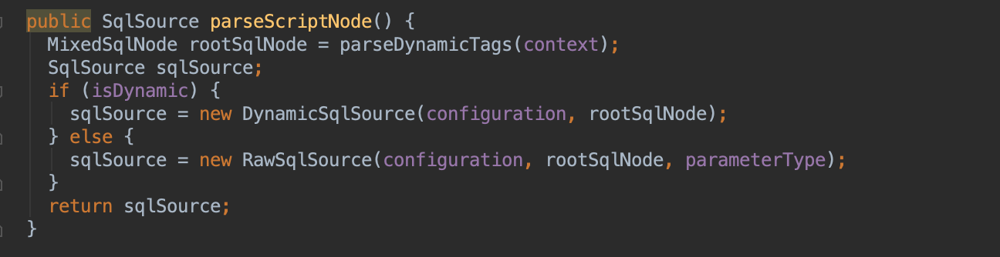
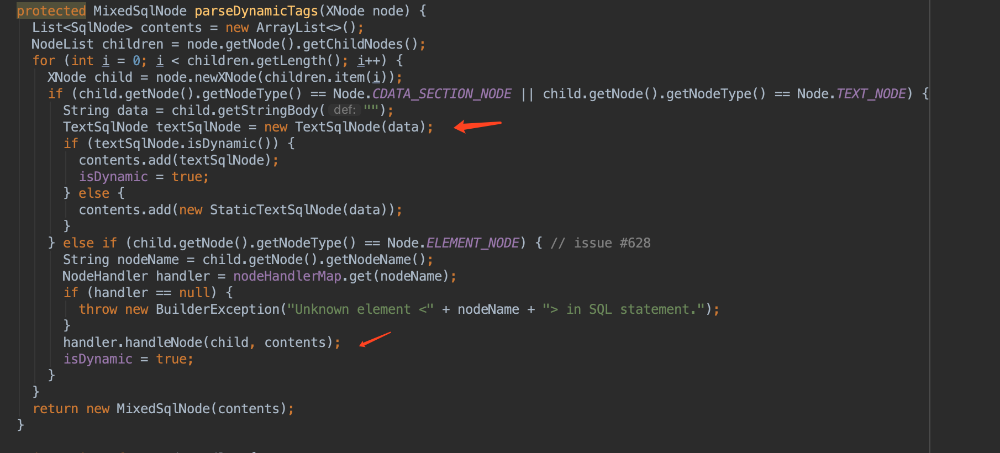
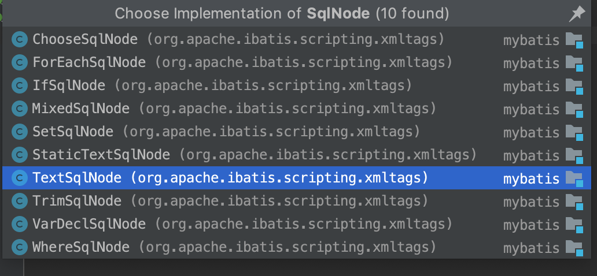
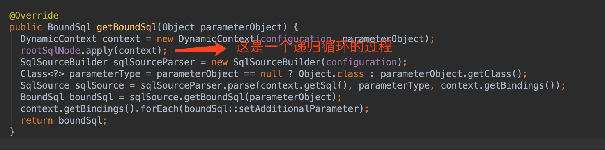
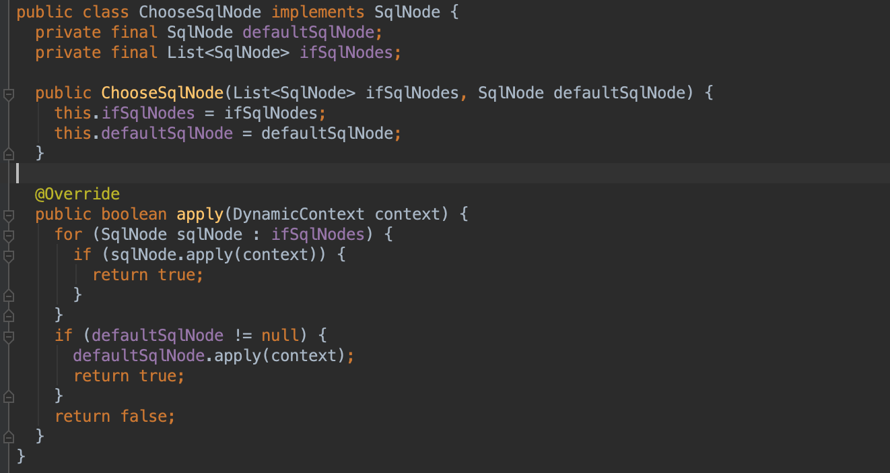
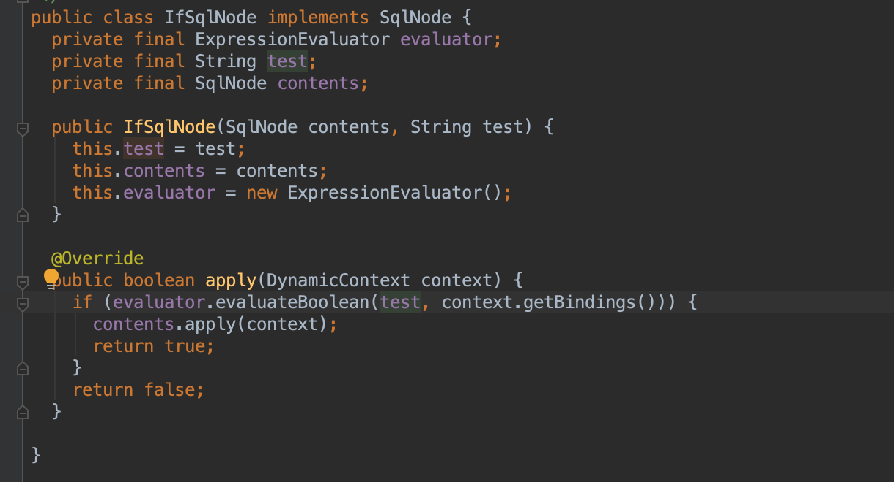

#### mybatis处理动态sql流程  
mybatis处理动态sql主要分为两部分：  
1、在把mapper文件的sql语句解析成对应的MappedStatement的时候，对动态sql的处理  
2、在执行sql的时候，根据传入的参数值去处理对应的动态sql的过程  
#### 解析过程中对动态sql的处理  
XML中对动态sql的解析都是在XMLScriptBuilder中处理的  

这里面主要关注几点：  
1、内置了一些动态sql的处理类  
2、所有的的动态sql根据类型分别封装为各种类型的SqlNode  

3、最终所有的SqlNode都封装在SqlSource中  
#### 执行过程中对动态sql的处理  
执行过程中动态sql的处理主要是在DynamicSqlSource的getBoundSql方法中 
不同类型的sqlNode提供了不同的apply方法的实现  

上图分别为foreach和if类型的动态sql的处理