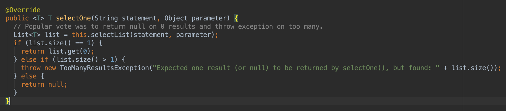
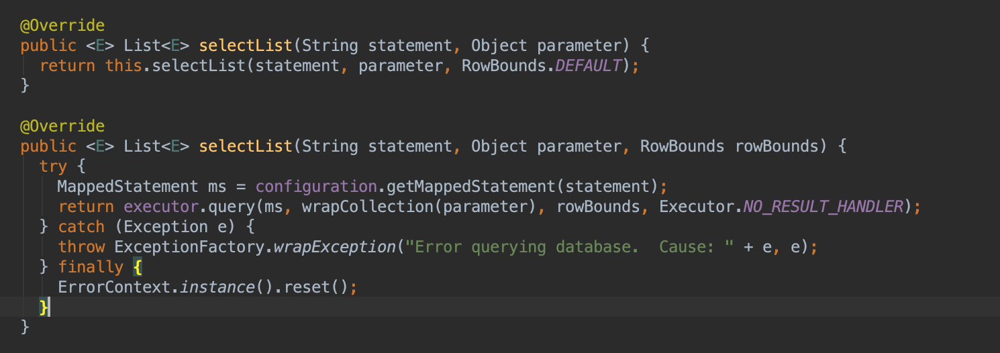
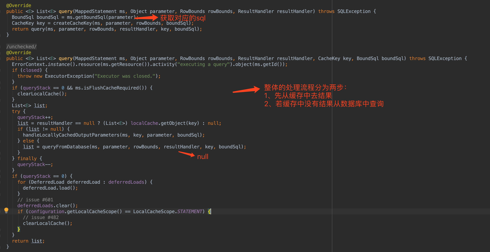
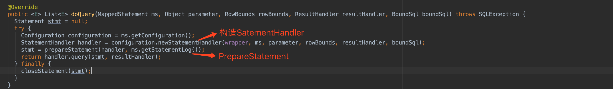
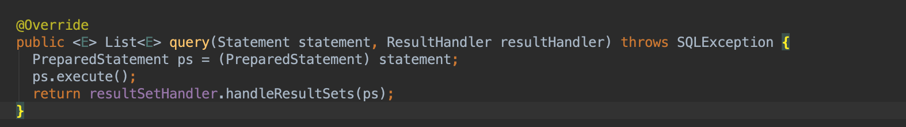

#### 整体流程  
通过SqlSession执行sql的入口为DefaultSqlSession.selectXXX()方法，我们以selectOne()方法为例讲解整体的执行流程。  

接下来进入到this.selectList(statement,parameter)方法中  

从图中我们可以看到，最终是调用了selectList的重载方法，在方法中，可以看到主要有两步流程：  
1、根据statement从Configuration中获取对应MappedStatement  
2、委派给Executor执行  
在BaseExecutor找到了对应的query方法  

接下来委派给BaseExecutor.doQuery方法，这个方法是一个抽象方法，有4个实现类实现了这个方法，我们看SimpleExecutor这个类的doQuery方法  

从上图中可以看到，最后交于StatementHandler.query方法，我们看一个具体的StatementHandler实现类的实现，下图是PreparedStatementHandler的实现  

主要流程：  
1、调用PreparedStatement.execute()方法执行  
2、调用ResultHandler的handlerResultSets方法组装结果  
